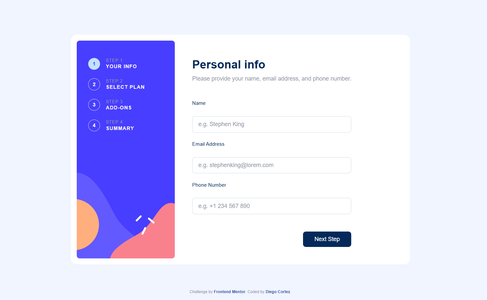
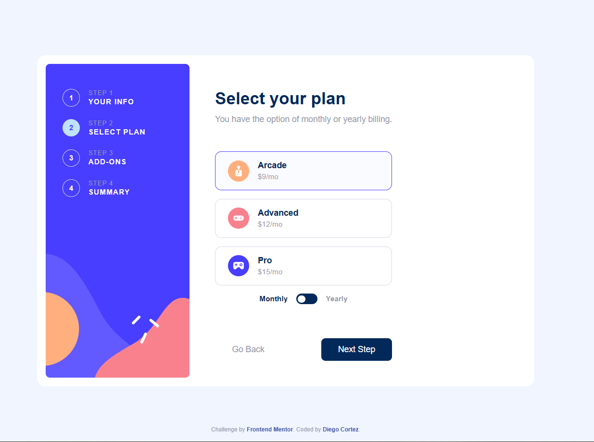
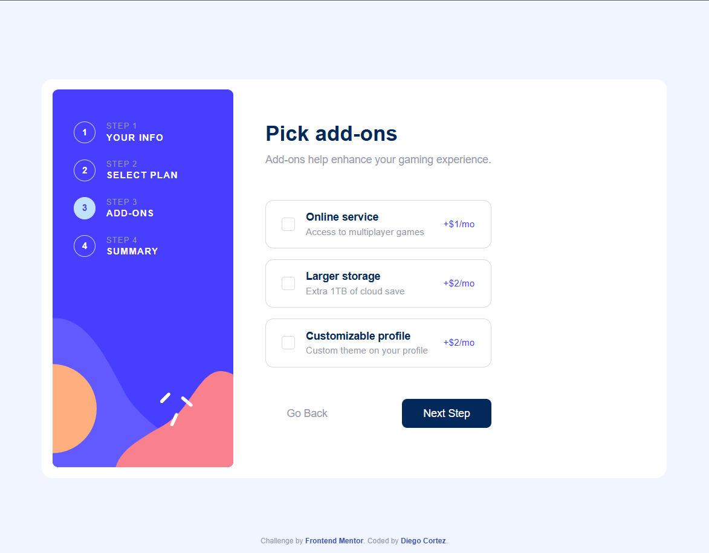
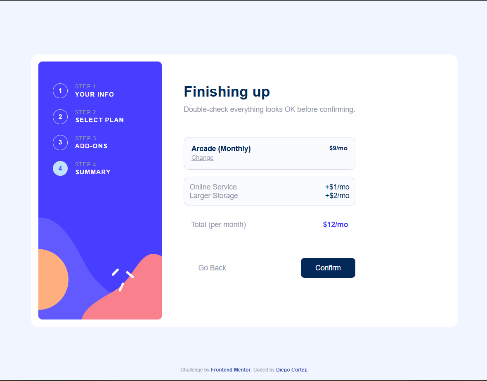
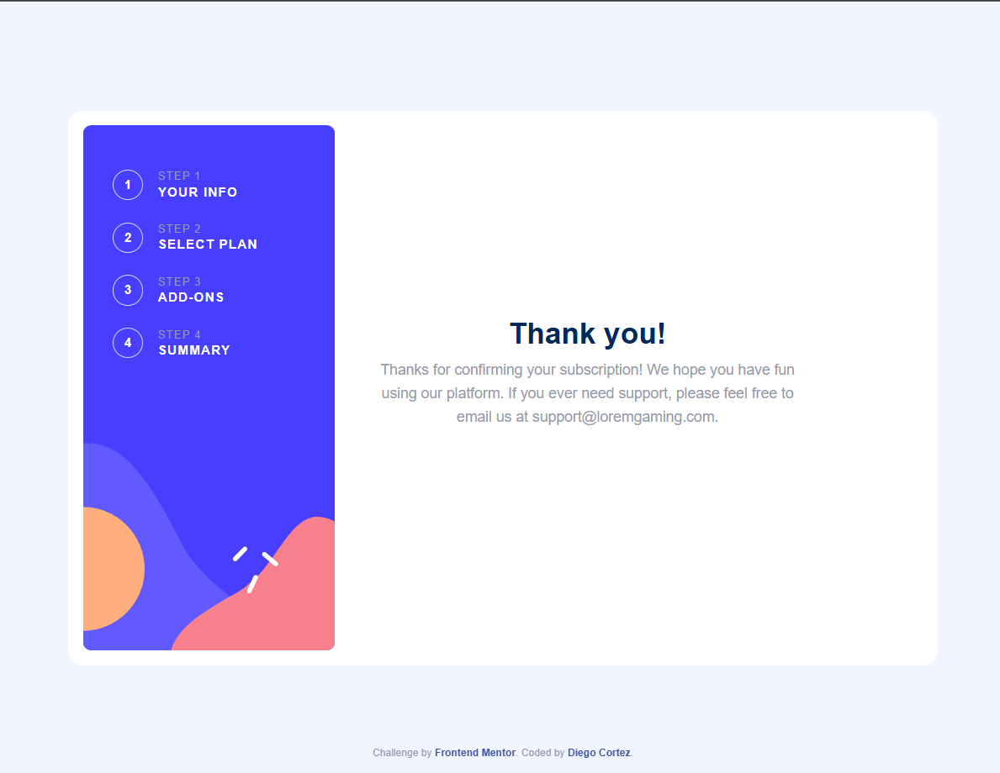
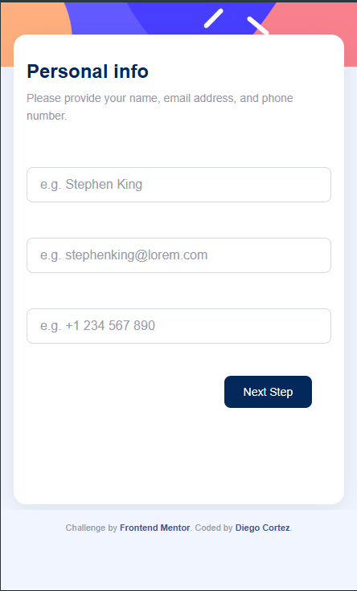
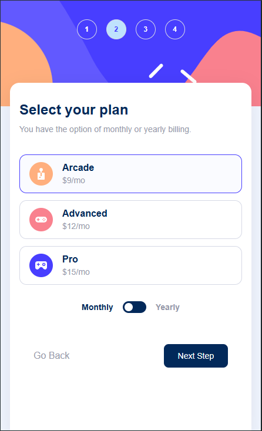
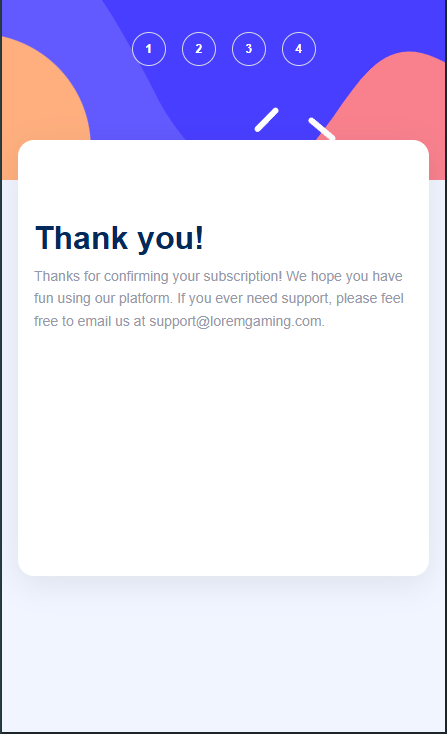

# Frontend Mentor - Multi-step form solution

This repository contains a vanilla JavaScript solution for the Frontend Mentor "Multi-step form" challenge: https://www.frontendmentor.io/challenges/multistep-form-YVAnSdqQBJ

## Table of contents

- [Overview](#overview)
- [The challenge](#the-challenge)
- [Screenshot](#screenshot)
- [Links](#links)
- [My process](#my-process)
  - [Built with](#built-with)
  - [What I learned](#what-i-learned)
  - [Continued development](#continued-development)
  - [Useful resources](#useful-resources)
  - [AI Collaboration](#ai-collaboration)
- [Author](#author)
- [Acknowledgments](#acknowledgments)

## Overview

This project implements a responsive, accessible multi-step form with client-side validation, a billing toggle (monthly/yearly), plan selection, add-ons, and a summary screen. It uses semantic HTML, modern CSS (Flexbox / Grid), and plain JavaScript to manage state and UI updates.

### The challenge

Users should be able to:

- Complete each step of the sequence and progress to the next step
- Go back to a previous step to update their selections
- Toggle billing between monthly and yearly and see prices update
- Select a plan and optional add-ons
- View a summary with calculated total before confirming
- Receive form validation messages for missing/invalid fields
- See a responsive layout that adapts to mobile and desktop

### Screenshots

Desktop

- Step 1 — Your info
  
- Step 2 — Select plan
  
- Step 3 — Add-ons
  
- Step 4 — Summary
  
- Step 5 — Thank you
  

Mobile (available)

- Step 1 — Mobile
  
- Step 2 — Mobile
  
- Step 5 — Mobile
  

### Links

- Solution URL: [Add solution URL here](https://your-solution-url.com)
- Live Site URL: [Add live site URL here](https://your-live-site-url.com)

Replace the placeholder links above with your repository and deployed site (GitHub Pages, Netlify, Vercel, etc.).

## My process

### Built with

- HTML5 (semantic markup)
- CSS3 (custom properties, Flexbox, Grid)
- JavaScript (vanilla ES6+)
- Mobile-first responsive design
- Accessibility considerations (ARIA attributes, focus states)

This project does not use React/Next.js — it is implemented with plain HTML/CSS/JS.

### What I learned

- Implementing a step-based state machine in plain JavaScript (`formState` object and `goToStep()` controller).
- Building client-side validation with user-friendly messages (see `validateStep1()` in `js/script.js`).
- Toggling UI and recalculating prices for monthly/yearly billing (see `btn-toggle` handler).
- Rendering a dynamic summary (selected plan, add-ons and computed total) with `renderSummary()`.
- Managing keyboard and click interactions to keep the form accessible and responsive.

Example: validation logic used for step 1 (name, email, phone) is implemented in `validateStep1()` and shows inline errors when rules fail.

### Continued development

- Add persistent storage (localStorage) to save progress between sessions.
- Improve animations and transitions for step changes.
- Add unit / integration tests for validation and summary calculations.
- Add internationalization (i18n) to support other languages.

### Useful resources

- Frontend Mentor challenge: https://www.frontendmentor.io/challenges/multistep-form-YVAnSdqQBJ
- MDN Web Docs — HTML forms and validation: https://developer.mozilla.org/en-US/docs/Learn/Forms
- MDN Web Docs — ARIA: https://developer.mozilla.org/en-US/docs/Web/Accessibility/ARIA

### AI Collaboration

I used AI tools during the project for documentation and brainstorming. Specifically, I used Claude AI to help phrase README content and suggest minor improvements to validation and UX. Code implementation and final decisions were made manually.

## Author

- Diego Cortez — https://github.com/Diego1399
- Frontend Mentor - [@Diego1399](https://www.frontendmentor.io/profile/Diego1399)

## Acknowledgments

Thanks to Frontend Mentor for the challenge and design files. Additional learning resources include MDN and CSS-Tricks.

If you want, I can also:

- Add the repository and live URLs if you share them.
- Translate the README to Spanish.
- Add more screenshots and update image paths.

